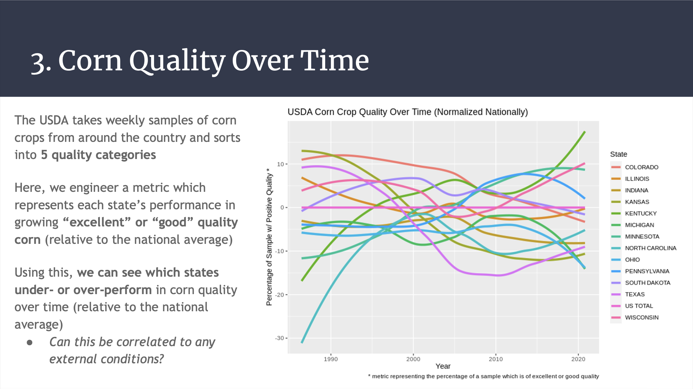

# atmospheric-quality-analysis
Group project at UT Dallas for STAT 3355 - Data Analysis, exploring atmospheric and crop quality over time

[**Evan Meade**](https://github.com/Evan-Meade) (Team Leader), Enrique Cardenas, Jay Shah

*Example slide highlighting Evan's engineered corn crop quality metric over time*

**For full results, see `Report.pdf`. For a visual summary, see `Presentation.pdf`.**

## Motivation

We wanted to see if we could highlight a specific effect of environmental degradation using large datasets and rigorous statistical techniques. In particular, we sought to investigate the impact of atmospheric conditions on crop health. Corn was our crop of choice because it is the most widely grown feed grain in the United States, and has a large historical dataset associated with its cultivation. This makes it a useful barometer for tracking environmental impacts over time.

## Data

Our atmospheric data was sourced from the EPA's [CASTNET database](https://java.epa.gov/castnet/clearsession.do), which provides hourly, daily, and weekly measurements of atmospheric conditions and trace gas concentrations. Selecting our indicators from 54 reporting locations, this amounted to 12,782 observations of 11 variables.

Our corn crop quality data was sourced from the USDA's [National Agricultural Statistics Service](https://quickstats.nass.usda.gov), which grades weekly corn samples from across the country according to 5 quality levels. Here we selected all historical data, amounting to 84,023 observations of 21 variables.

Taking the geographical intersection of these two datasets, we reduced our dataset to 13 states tracked from 1990 to 2020.

## Summary of Methods

**NOTE:** *We had to redo the file structure in order to put this repo in final submission format. Some of the code may reference file locations which have changed, but the scripts are otherwise fully functional.*

To be added

## Conclusions

To be added
